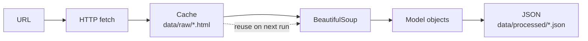

# CLAUDE.md

This file provides guidance to Claude Code (claude.ai/code) when working with code in this repository.

## Project Overview

**boarhat** is a web scraper for [Duet Night Abyss](https://boarhat.gg/games/duet-night-abyss/) game data from boarhat.gg. It's a Python CLI application managed with **uv** (Python >=3.10).

## Essential Commands

All commands use `uv` - never use pip or manual venv activation.

### Setup

```bash
uv sync                   # Install all dependencies
```

### Running Scrapers

```bash
# CLI entry point (installed via project.scripts)
uv run boarhat <command>

# Available scraper commands:
uv run boarhat character list          # List all characters
uv run boarhat character all           # Scrape all character details
uv run boarhat character get <slug>    # Scrape specific character
uv run boarhat weapon list             # Scrape weapons
uv run boarhat geniemon list           # Scrape geniemon
uv run boarhat demon-wedge list        # Scrape demon wedges
uv run boarhat all                     # Run all scrapers
uv run boarhat list                    # List available scrapers

# Common options:
--no-cache                # Force fetch from URL (ignore cache)
-o, --output <dir>        # Output directory (default: data/processed)
```

### Development Commands (Makefile)

```bash
make help          # Show all available commands
make install       # Install dependencies (uv sync)
make dev           # Install with dev dependencies
make lint          # Run ruff linter
make lint-fix      # Auto-fix linting issues
make format        # Format code with ruff
make format-check  # Check code formatting
make typecheck     # Run mypy (non-blocking warnings)
make check         # Run lint + format-check
make check-strict  # Run check + typecheck
make fix           # Auto-fix lint and format issues
make clean         # Clean cache files
```

### Dependency Management

```bash
uv add <package>          # Add runtime dependency
uv add --dev <package>    # Add dev dependency
uv remove <package>       # Remove dependency
uv lock                   # Update lockfile
```

## Architecture

### Scraper Pattern

All scrapers follow the same architecture pattern:

1. **BaseScraper** (`src/boarhat/scrapers/base.py`): Abstract base class using generics
   - `load_html()`: Fetches from URL or loads from file, with automatic caching
   - `scrape()`: Abstract method each scraper implements
   - `save_json()`: Saves data to JSON files
   - `run()`: Orchestrates the scraping workflow

2. **Data Models** (`src/boarhat/models/`): Python dataclasses with type hints
   - `to_dict()` and `from_dict()` methods for serialization
   - Uses `Literal` types for constrained values (e.g., element types, rarities)

3. **Concrete Scrapers** (`src/boarhat/scrapers/`): Implement `BaseScraper[T]`
   - Each scraper is generic over its model type
   - `category_name` property defines cache/output filename
   - `scrape()` method parses BeautifulSoup objects

### CLI Structure

The CLI (`src/boarhat/cli.py`) uses Click with command groups:

- `@cli.group()` for resource types (character, weapon, geniemon, demon-wedge)
- Subcommands under each group (list, get, all)
- Rich library for formatted table output

### Data Flow



Cache files are named by category and stored in `data/raw/`. Use `--no-cache` to force re-fetching.

## Adding a New Scraper

1. Create model in `src/boarhat/models/<name>.py` with `to_dict()` method
2. Create scraper extending `BaseScraper[YourModel]` in `src/boarhat/scrapers/<name>.py`
3. Implement `category_name` property and `scrape()` method
4. Register scraper in `src/boarhat/scrapers/__init__.py`
5. Add CLI command group in `src/boarhat/cli.py` with list/get/all commands
6. Update the `list` command table in `cli.py`

## Code Quality

- **Ruff**: Configured for line length 100, Python 3.10+ (E, W, F, I, B, C4, UP rules)
- **MyPy**: Type checking enabled but non-blocking in CI
- **Dependencies**: httpx (HTTP), BeautifulSoup4 + lxml (parsing), Click (CLI), Rich (formatting)
